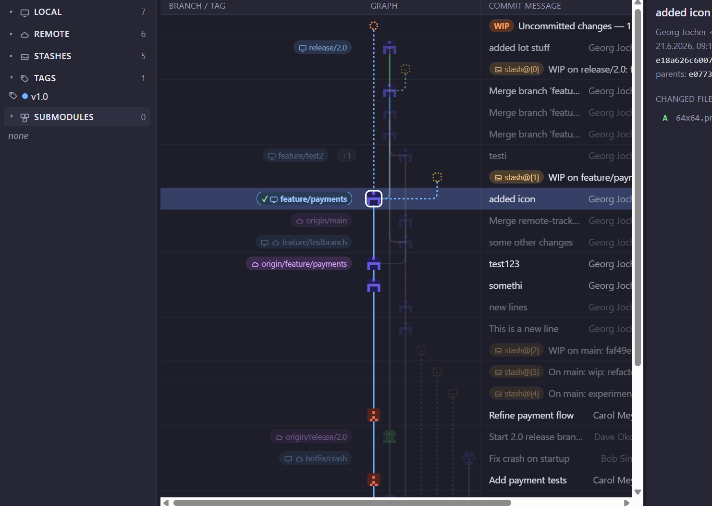
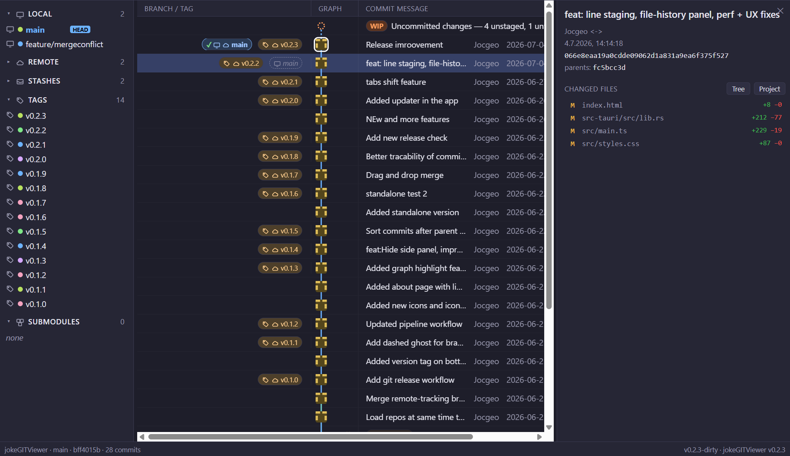

# jokeGITViewer

A fast, lightweight Git GUI for **Windows, Linux and macOS** — a slim, open take on
visual Git clients like GitKraken. See your whole history at a glance, manage
branches, stashes and submodules, stage down to the single line, resolve merge
conflicts and cherry-pick interactively — all from one window.

Built with **Tauri 2** (Rust backend + web UI) and the local **`git` CLI** — no
bundled libgit2, no heavy runtime. Small binary, native window.

> ⚠️ Hobby project. Git operations run real `git` commands on your repos —
> review what each action does before using it on important work.





---

## Features

### Commit graph
- Full **commit graph** with colored lanes and clean **orthogonal merge edges**
- Per-author **identicon avatars** on every commit (same author → same icon)
- **HEAD** ring + badge, **detached HEAD** flagged in red
- **Stashes** as dashed rectangles, **uncommitted changes** as a dashed WIP node
- Click a commit → its **whole branch lineage highlights**, before and after merges
- Three-column layout: **Branch/Tag · Graph · Commit message**
- **Virtualized rendering** — smooth even on repos with thousands of commits
- **Auto-refresh**: local changes are picked up within seconds, remotes are
  fetched in the background so incoming pushes just appear

### Repositories, branches & submodules
- **Multiple repos in tabs** — reorder by drag & drop, session restored on start
- **Submodules** in the sidebar: open one as its own tab, breadcrumbed to its parent
- Collapsible **Local / Remote / Stashes / Tags / Submodules** sections
- Local 🖥 / remote ☁ icons, branches sorted by most recent commit
- **Hide branches** from the graph, **search** branches / commits / tags
- Double-click a branch to check it out (dirty tree auto-stashes after a confirm)
- **Drag one branch onto another** in the graph → merge or rebase from a menu

### Diffs, blame & file history
- File diffs in the **main view**: full file, old/new line numbers,
  **character-level highlighting** of what changed inside a line
- Red/green **minimap** along the edge — click to jump
- **Blame**: who/when per line, click a line to jump to its commit
- **File history**: commit list panel next to the graph; the full graph stays,
  commits touching the file are highlighted with **+/− line counts**; click an
  entry to jump there
- Image diffs as before/after previews

### Staging & commits
- Stage / unstage files — or **single lines** straight from the diff (hover a
  changed line, click **+** / **−**)
- Changed files with **+green / −red** line counts, full **project tree** view
- Summary + description, **amend**, commit local — push stays a separate action

### Cherry-picking (commit → file → line)
- Whole commit (right-click), **one file** (right-click a file or the
  *Cherry-pick file* button — 3-way merge if the file drifted), or **single lines**
- **Interactive line picking**: split view with your working file on the left and
  the commit's version on the right — hover a change to see exactly where it
  would land, click to apply, click again to revert
- Changed lines are **replaced in place** (not duplicated), changes already in
  your file show **purple** and can't be picked twice
- Applied lines stay highlighted and can be **dragged to a new position** if the
  automatic placement was wrong

### Merge conflicts
- Built-in **3-pane resolver** (ours / result / theirs) with synced scrolling,
  line numbers and per-side color coding
- Take ours / theirs per file or per block, edit the result freely
- Works for merge, rebase, cherry-pick and revert conflicts; abort or continue
  from the same panel

### Toolbar & actions
- **Fetch · Pull · Push** (current branch only) **· Branch · Stash · Terminal · Search**
- Hover any button for the exact `git` command it runs; buttons grey out with a
  spinner while an action runs
- Right-click branches, commits, stashes, tags, files and repos for context
  actions: checkout, merge, rebase, reset (soft/mixed/hard), revert, cherry-pick,
  worktrees, tags (incl. push/delete remote), compare with working directory,
  open in Explorer / VS Code / terminal, and more
- Operations that need a clean tree **auto-stash** first so they never block

### Updates
- Checks GitHub for new releases on start; **updates and restarts in-app**
  (signed Tauri updater) and shows the release's **"What's changed"** notes

---

## Tech stack

| Layer | Tech |
|-------|------|
| Shell | Tauri 2 (Rust) |
| Backend | Rust → local `git` CLI via subprocess, parallelized queries |
| Frontend | TypeScript + Vite, hand-rolled virtualized SVG graph (no framework) |

---

## Requirements

- Windows 10/11, Linux or macOS (WebView2 ships with Windows 11)
- [Git](https://git-scm.com/) on `PATH`
- For building: [Rust](https://rustup.rs/) (1.86+) and [Node.js](https://nodejs.org/) 18+

---

## Install

Grab an installer or the portable build from the
[latest release](https://github.com/jocgeo/jokeGITViewer/releases/latest):

- Windows: `.msi` / NSIS setup `.exe`, or the **portable** `…_x64-portable.exe` (no install)
- Linux: `.deb` / `.AppImage`
- macOS: `.dmg` (universal)

## Build & run from source

```bash
npm install

# dev (hot reload)
npm run tauri dev

# production build -> installer + exe
npm run tauri build
```

Output after build:
- exe → `src-tauri/target/release/jkt.exe`
- installers → `src-tauri/target/release/bundle/` (`.msi`, NSIS `.exe`, …)

---

## License

[MIT](LICENSE) © Georg Jocher

Not affiliated with GitKraken or any other Git client. "Git" is a trademark of
the Software Freedom Conservancy.

Yes, it's vibecoded.
